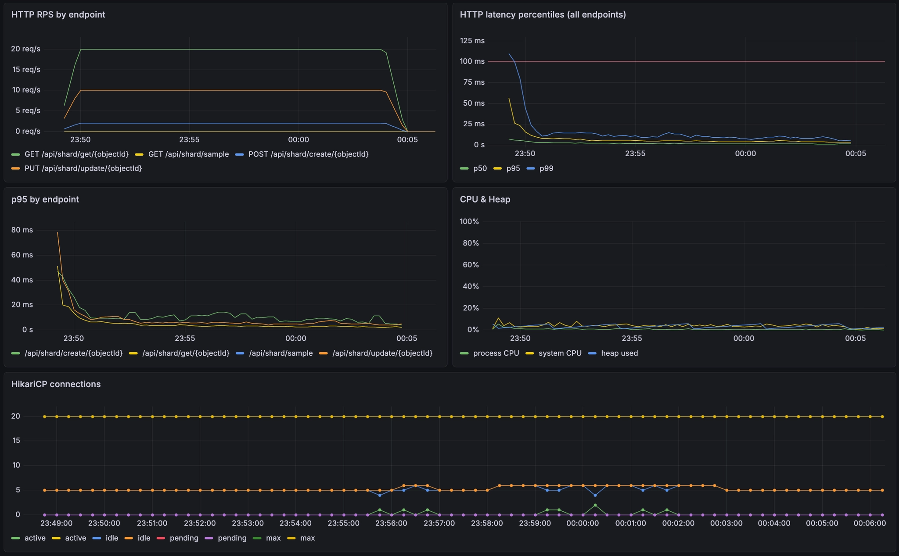

# Sharding Service

Микросервис на Spring Boot для управления индексами шардирования объектов. По UUID объекта хранит и обновляет порядковый номер шарда (0–1023).

## Стек

- **Java 26** + **Spring Boot 4**
- **PostgreSQL 17** (через `JdbcClient`)
- **Flyway** для миграций
- **Micrometer + Prometheus + Grafana** для метрик
- **k6** для нагрузочного тестирования
- **Testcontainers** для интеграционных тестов
- **JSpecify + NullAway (ErrorProne)** для статической проверки nullable
- **Docker Compose** для оркестрации окружения

## Как запустить

```bash
docker compose up -d --build
```

Поднимутся: app, postgres, prometheus, grafana.

Дальше нужно засидить базу, иначе нагрузочный тест не на чем будет гонять:

```bash
docker compose exec -T postgres psql -U sharding -d sharding < scripts/seed.sql
```

Сид кладёт 5 млн записей пачками по 500к. Занимает пару минут.

Запустить нагрузку:

```bash
docker compose --profile load-test run --rm k6
```

Тест идёт 15 минут, прогресс пишет прямо в терминал.

Куда смотреть:

- App: http://localhost:8080
- Prometheus: http://localhost:9090
- Grafana: http://localhost:3000 -- дашборд **Sharding Service** появится сам

## API

Все под: `/api/shard`

| Метод | Путь | Описание | Коды ответов |
|---|---|---|---|
| `POST` | `/create/{objectId}` | Создать индекс шарда для объекта | `201 Created`, `409 Conflict`, `400 Bad Request` |
| `PUT` | `/update/{objectId}` | Изменить индекс шарда | `200 OK`, `404 Not Found`, `400 Bad Request` |
| `GET` | `/get/{objectId}` | Получить индекс шарда | `200 OK`, `404 Not Found` |
| `GET` | `/sample?limit=N` | Случайная выборка UUID для нагрузочных тестов | `200 OK` |

### Примеры

**Создать:**
```bash
curl -X POST http://localhost:8080/api/shard/create/00000000-0000-0000-0000-000000000001 \
  -H "Content-Type: application/json" \
  -d '{"shardIndex": 42}'
```

**Получить:**
```bash
curl http://localhost:8080/api/shard/get/00000000-0000-0000-0000-000000000001
```

**Обновить:**
```bash
curl -X PUT http://localhost:8080/api/shard/update/00000000-0000-0000-0000-000000000001 \
  -H "Content-Type: application/json" \
  -d '{"shardIndex": 100}'
```

Валидация: `shardIndex` должен быть в диапазоне `[0, 1023]`.

## Схема БД

```sql
CREATE TABLE object_shard (
    object_id   UUID        NOT NULL,
    shard_index SMALLINT    NOT NULL,
    updated_at  TIMESTAMPTZ NOT NULL DEFAULT NOW(),
    CONSTRAINT object_shard_pk PRIMARY KEY (object_id),
    CONSTRAINT object_shard_index_range CHECK (shard_index BETWEEN 0 AND 1023)
);
```
PK по object_id — он же даёт O(log n) на get и атомарность на create через нарушение уникальности.
Миграции применяются Flyway при старте приложения из `src/main/resources/db/migration`.

## Архитектура

```
api/          -- REST-контроллеры, DTO, обработчик исключений
service/      -- бизнес-логика
domain/       -- репозитории, доменные модели, exceptions
utils/        -- мапперы
```

Тонкий слой над `JdbcClient` -- без JPA, чтобы держать предсказуемое время запросов под нагрузкой.

## Тесты

```bash
./gradlew test
```

Что покрыто:

- сервисный слой моками, проверка маппинга и пробрасывания исключений
- контроллер  `@WebMvcTest`, статусы, валидация, обработка ошибок
- интеграционный тест на Testcontainers реальный Postgres, реальный HTTP, плюс два конкурентных сценария:
    - 8 потоков пытаются создать одну и ту же запись, ровно один получает 201, остальные 409
    - 16 потоков по 25 апдейтов одного id, ни одной ошибки, итоговое значение валидно

## Нагрузка

Скрипт лежит в `load-tests/load-test.js`. Три сценария идут параллельно по 15 минут:

| Сценарий | TPS | Endpoint |
|---|---|---|
| create | 1 | `POST /create/{id}` |
| update | 5 | `PUT /update/{id}` |
| get | 10 | `GET /get/{id}` |

В `setup()` k6 тянет 10к UUID через `/sample` и потом случайно выбирает из этого пула для update/get. Для create генерит свежие UUID на лету.

Пороги по ТЗ зашиты в k6 thresholds:
- p95 < 100мс на каждый endpoint
- доля ошибок < 1%

Запуск:
```bash
docker compose --profile load-test run --rm k6
```

Перед запуском база должна быть засидена (5 млн записей через `scripts/seed.sql`) `setup()` теста забирает 10 000 UUID для пула.

# Метрики

Spring отдаёт всё нужное на `/actuator/prometheus`. Prometheus скрейпает каждые 5 секунд.

В дашборде Grafana пять панелей:

- **HTTP RPS by endpoint** — сколько запросов в секунду по каждой ручке
- **HTTP latency percentiles** — p50/p95/p99 со всех endpoint, плюс красная линия на 100мс для наглядности
- **p95 by endpoint** — то же самое, но в разбивке
- **CPU & Heap** — загрузка процесса
- **HikariCP connections** — состояние пула, чтобы видеть упирается оно в потолок или нет

### 15 минутная нагрузка



## Результаты

На одной поде под нагрузкой 16 TPS (1+5+10):

- p95 5 - 15мс по всем endpoint 
- CPU процесса 2 – 5%
- Heap 5 – 10% от макс
- Hikari 5 – 6 активных коннектов из 20

Запас огромный, одна пода очевидно переварит сильно больше.

## Конфигурация

Через environment variables (см. `application.properties`):

| Переменная | По умолчанию | Описание |
|---|---|---|
| `DB_URL` | `jdbc:postgresql://localhost:5432/sharding` | JDBC URL |
| `DB_USER` | `sharding` | Пользователь БД |
| `DB_PASSWORD` | `sharding` | Пароль БД |
